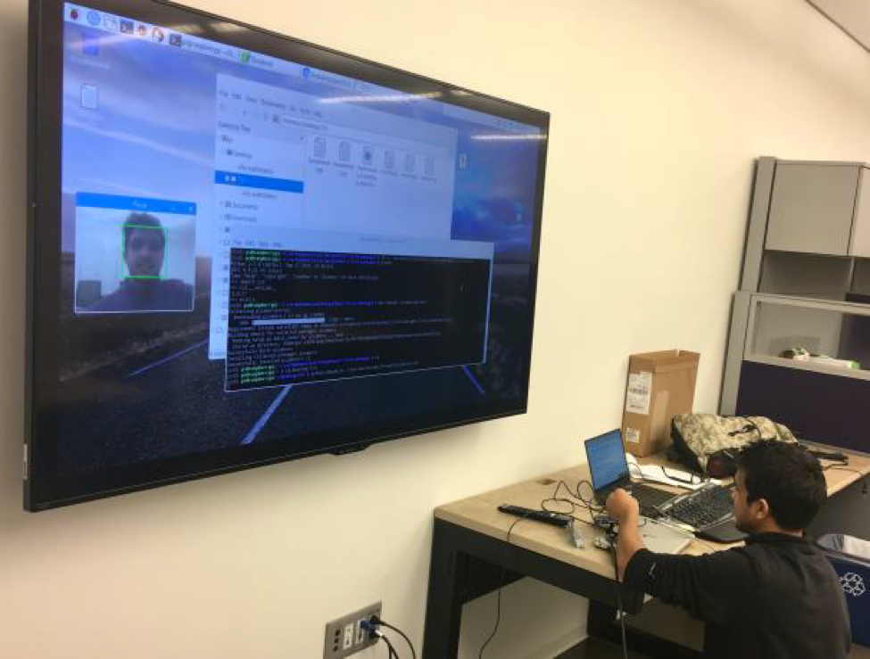
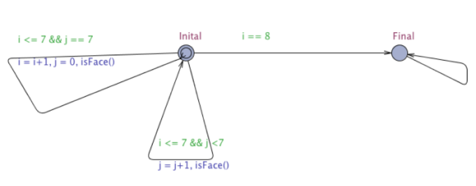

# Table of Contents
1. [Problem Summary](README.md#problem-summary)
2. [Implementation](README.md#implementation)

## Problem Summary
[Back to Table of Contents](README.md#table-of-contents)
This project was part of my project work for CIS721(Real-time systems) in Fall 2016. This project focus on detecting an object in real-time. This project focuses specifically on detecting faces in real-time. Face detection finds application in a several fields that include as security, event management, etc. Face detection is preliminary step of a bigger application – “Face Recognition”. There are several challenges in the face detection such as changes in facial appearance with varying illumination, changes in pose or expression or emotions, changes in image position or scale or orientation image change. All

## Implementations
[Back to Table of Contents](README.md#table-of-contents)
This project implements a widely used method for real-time face detection know as Viola Jones face detection framework. This framework has four stages  - 
1. Haar Feature Selection.
2. Creating an Integral Image.
3. Feature Selection with Adaboost.
4. Cascading Classifiers.

This model was created using OpenCV libraries and RaspberryPi3. The model built was tested with Uppaal, a tool environment for modeling, validation and verification of real-time systems modeled as networks of timed automata, extended with data types.

